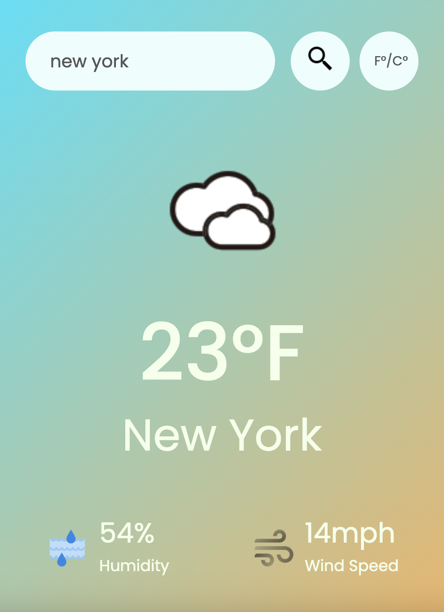

# Weather App
This is a simple Weather App built using HTML, CSS, and JavaScript. The app allows users to search for the current weather conditions of a specific city. The weather information includes temperature, humidity, wind speed, and an icon representing the weather condition.

# Features
- **Search Functionality:** Users can enter the name of the city they want to check the weather for.
- **Error Handling:** If the entered city is not found, an error message is displayed.
- **Temperature Conversion:** Converts temperature from Fahrenheit to Celsius
- **Weather Information:** Displays temperature in Fahrenheit/Celsius, humidity percentage, wind speed, and a weather icon.

# Getting Started
1. Clone or download the repository to your local machine.
2. Open the index.html file in a web browser.
# Usage
1. Enter the name of the city in the search input.
2. Click the search button.
3. View the current weather details for the specified city.
# APIs Used
This Weather App utilizes the [OpenWeatherMap API](https://openweathermap.org/api) to fetch real-time weather data.

# Project Structure
- **index.html:** HTML file containing the structure of the Weather App.
- **style.css:** CSS file for styling the Weather App.
- **index.js:** JavaScript file for handling API requests and updating the UI.

# Contributing
Contributions are welcome! If you find any issues or have suggestions for improvements, feel free to open an issue or create a pull request.

# License
This Weather App is open-source and available under the MIT License.